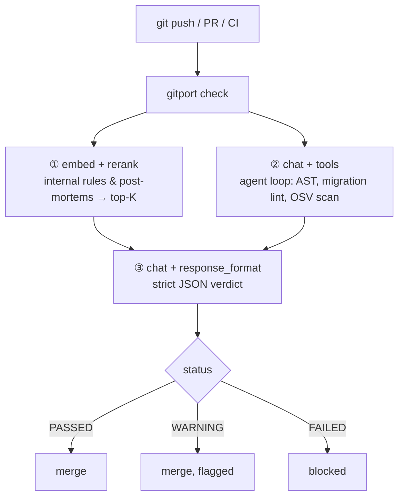

# gitport

**AI-native pre-merge gatekeeper.** `gitport` inspects a git diff before it
lands, retrieves your team's internal engineering rules, runs real checks
through a Cohere tool-use agent loop — AST analysis, SQL migration hazards,
dependency CVEs — and returns a strict `PASSED` / `WARNING` / `FAILED` verdict
your pipeline can gate on.

Not a chatbot wrapper: the model *orchestrates* deterministic tools, and the
final call is schema-constrained so the output is machine-readable every time.

## How it works



1. **Retrieval** — `gitport index` embeds your internal docs (design rules,
   runbooks, post-mortems) with `cohere.embed` into a local SQLite vector
   store. Each `gitport check` reranks candidates with `cohere.rerank` and
   injects the top-3 rules into context.
2. **Agent loop** — `cohere.chat` with tool definitions. The model calls real
   tools (`analyze_python_file`, `lint_migration_file`, `scan_manifest`,
   `read_file`) against the diff and gathers evidence instead of guessing.
3. **Gate** — a final `cohere.chat` with `response_format={"type":
   "json_object", "schema": …}` returns the verdict: status, breaking-change
   flag, and per-file flaws with line numbers and fix suggestions.

```json
{
  "status": "FAILED",
  "breaking_changes_detected": true,
  "critical_flaws": [
    {
      "file": "migrations/0012_add_email.sql",
      "line": 1,
      "issue": "ADD COLUMN NOT NULL without DEFAULT rewrites and locks the users table",
      "fix_suggestion": "Add the column nullable, backfill in batches, then set NOT NULL",
      "severity": "high"
    }
  ],
  "summary": "Migration will lock the users table during deploy.",
  "rules_applied": ["migrations.md"]
}
```

## Install

```bash
pip install gitport                 # when published
# or from source:
pip install "git+https://github.com/rayhankhilji/gitport-ai"

export COHERE_API_KEY=...           # or put it in .env
```

## CLI

```bash
# one-time: embed your internal docs into the local rules index
gitport index --rules-dir docs/rules

# gate the current branch against main
gitport check --base origin/main --head HEAD

# other sources
gitport check --staged
gitport check --diff-file pr.patch
git diff main... | gitport check --diff-file -

# machine-readable
gitport check --base main --json
```

| exit code | meaning |
|---|---|
| `0` | PASSED (or WARNING) |
| `1` | FAILED — do not merge |
| `3` | engine error with `--fail-open` |

Useful flags: `--strict` (WARNING also fails), `--fail-open` (infra errors
warn instead of blocking — the default is **fail closed**).

### Git hook

```bash
gitport install-hook              # pre-push (client-side)
gitport install-hook pre-receive  # server-side, in the bare repo
```

### GitHub Action

See [`examples/github-action.yml`](examples/github-action.yml) — index rules,
then `gitport check --base origin/$BASE --head HEAD --strict` on every PR.

## MCP server

Expose gitport to any MCP-aware agent (Devin, Cursor, Claude Code):

```bash
gitport-mcp          # stdio transport
```

```json
{ "mcpServers": { "gitport": { "command": "gitport-mcp",
    "env": { "COHERE_API_KEY": "..." } } } }
```

Tools: `gitport_check` (git range), `gitport_check_diff` (raw patch),
`gitport_index_rules`, plus keyless `gitport_lint_migration` and
`gitport_analyze_python` for quick one-off checks.

## REST API

```bash
gitport serve --port 8400
```

```bash
curl -X POST localhost:8400/v1/check \
  -H 'content-type: application/json' \
  -d '{"diff": "'"$(git diff main...)"'"}'
```

`GET /healthz`, `GET /v1/schema` (the verdict contract), `POST /v1/index`.
Set `GITPORT_API_TOKEN` to require `Authorization: Bearer` on `/v1/*`.

## Configuration

| env | default | purpose |
|---|---|---|
| `COHERE_API_KEY` | — | required for check/index |
| `GITPORT_CHAT_MODEL` | `command-a-plus-05-2026` | agent + verdict model |
| `GITPORT_EMBED_MODEL` | `embed-v4.0` | doc/query embeddings |
| `GITPORT_RERANK_MODEL` | `rerank-v3.5` | rule reranking |
| `GITPORT_INDEX_PATH` | `.gitport/index.sqlite3` | vector store |
| `GITPORT_RULES_DIR` | `docs/rules` | docs to index |
| `GITPORT_TOP_K_RULES` | `3` | rules injected per check |
| `GITPORT_AGENT_MAX_STEPS` | `8` | tool-loop budget |
| `GITPORT_API_TOKEN` | unset | bearer auth for the API |
| `GITPORT_FAIL_OPEN` | `0` | `1` downgrades engine errors to warnings |

## Why a gatekeeper, not a reviewer

The design rule: **the model never invents findings.** Tools produce evidence
(a parse tree, a lock-hazard lint, an OSV hit); the model decides which tools
to run and weighs the results against retrieved team rules; a schema-forced
verdict makes the output contract-stable. If Cohere is unreachable or the key
is missing, gitport fails closed — an unchecked merge is the dangerous state.

## Development

```bash
python -m venv .venv && .venv/bin/pip install -e ".[dev]"
.venv/bin/pytest          # 45 tests, fully mocked — no API key needed
.venv/bin/ruff check src tests
```

Layout: `src/gitport/` — `diff.py` (parsing), `rules.py` + `store.py`
(embed→sqlite→rerank), `analysis.py` + `tools.py` (the agent's tools),
`agent.py` (tool loop), `gate.py` (structured verdict), `engine.py`
(orchestration), `cli.py` / `mcp_server.py` / `api.py` (the three surfaces).

MIT licensed.
