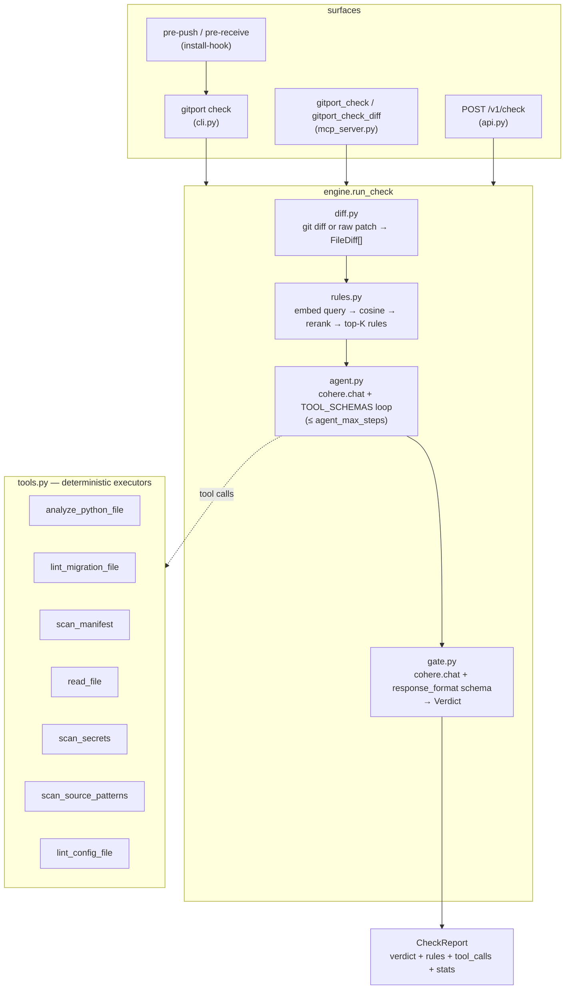

# Architecture

`gitport` is one pipeline with three surfaces. `engine.run_check` is the only
entry point — the CLI, the MCP server, and the REST API all call it, so every
surface produces identical verdicts.

Design rule: **the model never invents findings.** Detectors produce
evidence; the agent decides which to run; the verdict call is
schema-constrained. Infra failures default to `FAILED` (fail closed) unless
`--fail-open` / `GITPORT_FAIL_OPEN=1` downgrades them to `WARNING`.

## Module map

| File | Responsibility |
|---|---|
| `src/gitport/diff.py` | `git diff` subprocess wrapper (`base...head`, staged, empty-tree base for new refs) and unified-diff parser → `FileDiff` with post-change line numbers; `diff_digest` renders a token-bounded prompt view |
| `src/gitport/rules.py` | Heading-aware doc chunking; `build_index` (embed corpus → store); `retrieve_rules` (embed query → cosine candidates → rerank → `RetrievedRule[]`) |
| `src/gitport/store.py` | `VectorStore` — SQLite + JSON-blob embeddings, pure-Python cosine `top_k`. Three-function interface; swap for a real vector DB if a corpus outgrows it |
| `src/gitport/analysis.py` | Deterministic analyzers: `analyze_python_source` (AST), `lint_sql_migration` (10 hazard rules), `scan_dependencies` (OSV querybatch) |
| `src/gitport/detectors/secrets.py` | `scan_text_for_secrets` — 8 named credential patterns + a Shannon-entropy heuristic on added lines; matches masked to a 6-char preview |
| `src/gitport/detectors/langs.py` | `detect_language` + `scan_source_patterns` — per-line danger rules for JS/TS, Go, Java, Ruby, PHP, plus `pdb`/`breakpoint` for Python |
| `src/gitport/detectors/confchecks.py` | `lint_config` — Dockerfile (`remote-add`, `pipe-to-shell`, `env-secret`, `unpinned-base-image`, `root-user`, `missing-user`) and GitHub Actions (`unpinned-action`, `pull-request-target-checkout`, `script-injection`) |
| `src/gitport/tools.py` | `TOOL_SCHEMAS` (JSON schemas for `cohere.chat`), `execute_tool` dispatch, `ToolContext` — sandboxed source resolution (repo file → diff-added lines; path-escape refusal; 40 KB cap) |
| `src/gitport/agent.py` | Step 2: tool-use loop. Forwards tool calls until the model stops calling or `agent_max_steps` (default 8) is hit; returns notes + audit transcript |
| `src/gitport/gate.py` | Step 3: verdict call with `VERDICT_SCHEMA`, temperature 0, one JSON-repair retry; `_parse_verdict` tolerates markdown fences |
| `src/gitport/policy.py` | Policy-as-code: `load_policy` (`.gitport/policy.toml`), `apply_policy` (floor → suppress → escalate → recompute status), `should_fail` |
| `src/gitport/engine.py` | `run_check` orchestration, `make_client` (raises `EngineError` without `COHERE_API_KEY`), `error_verdict` (fail-closed default) |
| `src/gitport/models.py` | Pydantic boundary models — see below |
| `src/gitport/config.py` | `Settings` (pydantic-settings): every knob env-overridable via `GITPORT_*` + `.env`, `COHERE_API_KEY` unprefixed |
| `src/gitport/formatters.py` | `render(report, fmt)` — `json`, `markdown` (PR comments), `sarif` 2.1.0 (code scanning), `junit` (test-report ingestion) |
| `src/gitport/github.py` | `post_pr_comment` (upserts a `<!-- gitport -->` marker comment), `set_commit_status` (PASSED/WARNING→success, FAILED→failure); `GITHUB_TOKEN` auth, injectable `http` |
| `src/gitport/reports.py` | `ReportStore` — one SQLite row per check: summary columns + full `report_json`; `save`/`get`/`list`/`stats` audit queries |
| `src/gitport/server.py` | Pure-ASGI middleware: `RequestIDMiddleware` (`X-Request-ID`), `BodyLimitMiddleware` (413 over `max_request_bytes`), `RateLimitMiddleware` (429 sliding window, `/healthz` exempt), `json_logging` |
| `src/gitport/cli.py` | Typer app: `check`, `index`, `install-hook`, `serve`, `mcp`, `version`; Rich rendering; `--format` json/markdown/sarif/junit; `--post-comment`/`--set-status`; `--policy`; exit codes |
| `src/gitport/mcp_server.py` | stdio MCP server (mcp 1.x/2.x shim): `gitport_check`, `gitport_check_diff`, `gitport_index_rules`, keyless `gitport_lint_migration`, `gitport_analyze_python`, `gitport_scan_secrets` |
| `src/gitport/api.py` | FastAPI: `GET /healthz`, `POST /v1/check` (returns `CheckReport` + `id`), `POST /v1/index`, `GET /v1/schema`, `GET /v1/checks[/{id}]`, `GET /v1/stats`; bearer auth when `GITPORT_API_TOKEN` is set; shared `{"error": {type, message, request_id}}` envelope (EngineError→400, validation→422, unhandled→502) |

## The three Cohere call sites

All calls go through `cohere.ClientV2`, built once by `engine.make_client`.
The client is injectable everywhere — tests substitute `FakeCohereClient`.

| Call | Site | Request shape |
|---|---|---|
| `embed` | `rules.build_index` — corpus | `model=embed_model` (`embed-v4.0`), `texts` in batches of ≤ 96, `input_type="search_document"`, `embedding_types=["float"]` |
| `embed` | `rules.retrieve_rules` — query | same, but `texts=[digest[:8000]]`, `input_type="search_query"` |
| `rerank` | `rules.retrieve_rules` | `model=rerank_model` (`rerank-v3.5`), `query=digest[:4000]`, `documents=[candidate chunks]` (up to `embed_candidate_k` = 25), `top_n=min(top_k_rules, len)` |
| `chat` | `agent.run_agent` — loop | `model=chat_model` (`command-a-plus-05-2026`), `messages=[system, user(rules+digest), assistant/tool …]`, `tools=TOOL_SCHEMAS`, `temperature=0.2`; tool results appended as `{"role": "tool", "tool_call_id", "content": [{"type": "document", …}]}` until no tool calls or step budget hit |
| `chat` | `gate.evaluate` — verdict | `model=chat_model`, `messages=[system, user(rules+notes+findings+digest)]`, `temperature=0`, `response_format={"type": "json_object", "schema": VERDICT_SCHEMA}`; on malformed output exactly one repair retry appending the bad answer |

A missing or empty index degrades gracefully: retrieval returns `[]`, the
gate still runs on tool findings.

## Data models (`models.py`)

| Model | Fields | Role |
|---|---|---|
| `AddedLine` | `lineno`, `text` | one added line, tracked on post-change numbering |
| `FileDiff` | `path`, `old_path`, `is_new`, `is_deleted`, `is_binary`, `added[]`, `deleted_count` | one file's change; `added_source` reconstructs added-lines text |
| `RetrievedRule` | `source`, `heading`, `excerpt` (≤ 800 chars), `score` | a reranked internal rule |
| `ToolCallRecord` | `name`, `arguments`, `ok`, `summary` | audit-trail entry per tool call |
| `Flaw` | `file`, `line`, `issue`, `fix_suggestion`, `severity` (`low`/`medium`/`high`/`critical`) | one cited flaw |
| `Verdict` | `status`, `breaking_changes_detected`, `critical_flaws[]`, `summary`, `rules_applied[]`, `error` | mirrors `gate.VERDICT_SCHEMA`; `error` set only on engine failure |
| `CheckReport` | `verdict`, `rules[]`, `tool_calls[]`, `agent_notes`, `files_changed`, `lines_added`, `elapsed_seconds` | the wire contract — `--json`, `POST /v1/check`, MCP tool returns all serialize this |

`VERDICT_SCHEMA` (also served at `GET /v1/schema`) requires `status`,
`breaking_changes_detected`, `critical_flaws`; `status ∈ {PASSED, WARNING,
FAILED}`.

## Exit codes (`gitport check`)

| Code | Condition |
|---|---|
| `0` | `PASSED`, or `WARNING` without `--strict` — including engine errors under `--fail-open` |
| `1` | verdict status is in the policy's `fail_on` (default `["FAILED"]`), or `WARNING` with `--strict` |
| `3` | invalid `--policy` file; or a report carrying `verdict.error` with a status that isn't in `fail_on` while fail-closed (e.g. engine error + a policy that doesn't list `FAILED`) |

`index` and `install-hook` exit `3` on their own failures.

## Extension points

- **New agent tool** — `tools.py`: one `_fn(...)` schema in `TOOL_SCHEMAS`,
  one branch in `execute_tool`, one `_t_*` executor returning a JSON-able
  dict (`{"ok": ...}`; never raise). Get content via `ctx.source_for(path)`
  (post-change repo file, falling back to diff-added lines) or
  `ctx.added_source_for(path)` (added lines only — right choice for
  merge-gate findings).
- **New deterministic check** — put the scanner in `analysis.py` or
  `detectors/`, wrap it as a tool. Keep findings factual: rule ID, line,
  why, suggestion — severity judgment belongs to the gate.
- **Vector store** — `store.VectorStore` is deliberately small:
  `reset`, `add_many`, `count`, `top_k`, `embed_model`. Replace the file
  (or the class) to back retrieval with pgvector/Qdrant/etc.; `rules.py` is
  the only consumer.
- **Output formats** — `formatters.render(report, fmt)` produces `json`,
  `markdown`, `sarif`, `junit`; the CLI picks one via `--format`, GitHub PR
  comments reuse `markdown`. Add a format by adding a function and a `_Format`
  enum member — don't fork the pipeline.
- **Policy** — `.gitport/policy.toml` (auto-loaded from the repo root when it
  exists; `--policy` overrides; `GITPORT_POLICY_PATH` sets the default path)
  shapes the verdict after the gate: `severity_floor` drops findings,
  `[[suppress]]` removes accepted risks (counted in the summary),
  `[[escalate]]` bumps sub-`high` flaws on matching paths to `high`, and
  `fail_on` chooses which statuses block. See
  [deployment.md](deployment.md#e-policy-file).
- **GitHub side-effects** — `github.py` posts the upserted PR comment
  (`--post-comment --pr --repo-slug`) and commit statuses
  (`--set-status --sha --repo-slug`); failures warn on stderr, never gate.
- **Surfaces** — anything that can call `run_check(cfg, client=…, …)` is a
  valid front end; inject `client` to run fully offline.

## Trust boundaries

- Tools are read-only. `ToolContext.source_for` resolves paths under
  `repo_root`, refuses escapes (`relative_to` check), and caps reads at
  `_MAX_FILE_CHARS` (40 KB). The agent can read code, never write or execute
  it.
- `scan_secrets` masks matched values — transcripts and reports carry the
  pattern name, not the secret.
- `/v1/*` requires `Authorization: Bearer $GITPORT_API_TOKEN` when set;
  `/healthz` is intentionally open (and exempt from rate limiting).
- `server.py` middleware wraps the API: `X-Request-ID` on every response,
  `Content-Length` body cap → 413 (`GITPORT_MAX_REQUEST_BYTES`), per-client-IP
  sliding-window rate limit → 429 + `Retry-After` (`GITPORT_RATE_LIMIT_RPM`,
  in-memory per worker — front replicas with a shared limiter), CORS only
  when `GITPORT_CORS_ORIGINS` is set, and JSON access logs via
  `GITPORT_LOG_FORMAT=json`.
- Persisted reports (`GITPORT_REPORTS_DB`, `GITPORT_STORE_REPORTS=0` to
  disable) hold full verdict JSON — audit them before shipping the DB
  anywhere.
- Data leaves the machine: diff digest + rules + tool results → Cohere;
  pinned manifest deps → `api.osv.dev`. `scan_manifest` degrades to
  `{"ok": false}` on network failure rather than breaking the gate.
